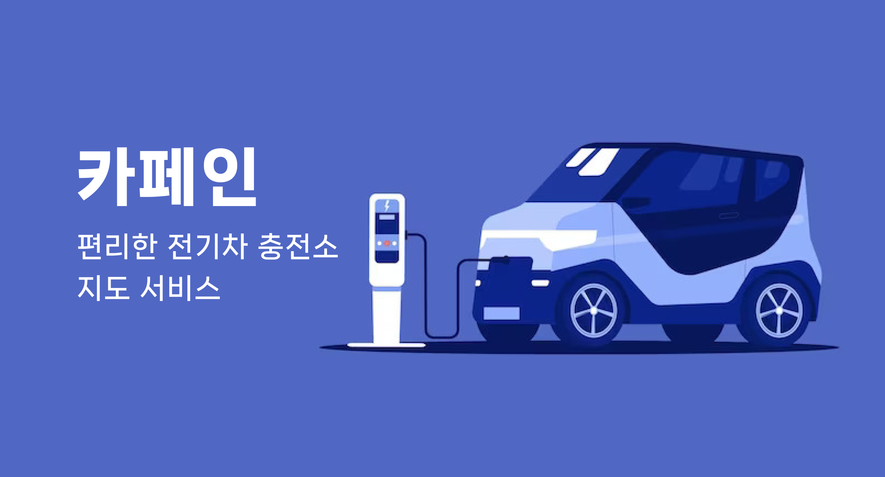

# 2023 우아한테크코스 5기 카페인 팀

<a href="https://carffe.in">
  

    
  

  

    카페인 바로가기
  

</a>

  실시간 전기자동차 충전소 지도 및 사용 통계 조회 서비스

## 프로젝트 소개

카페인 서비스는 전국 24만개의 충전기 정보를 실시간으로 제공하고, 각 충전소의 혼잡도 정보를 제공함으로써 전기차 사용자들의 자발적인 분산 이용을 유도하는 서비스 입니다.

 

### 설치할 필요가 없습니다.

이 서비스는 웹 브라우저만 있다면 설치하지 않아도 구동할 수 있습니다. PC와 모바일 모두 대응하며, 앱 환경에서 사용을 원하시는 경우 브라우저에서 `홈 화면에 바로가기 추가`를 눌러 사용할 수 있습니다.

 

### 기존의 웹 서비스를 대체합니다.

기존에 출시된 전기자동차 충전소 조회 웹 서비스들은 굉장히 느리고 불편합니다. 카페인에서는 `사용자 경험을 네이티브 앱 환경만큼 크게 개선`하였습니다. 전국 충전소를 검색할 수 있는 것은 물론이고, 원하시는 지역을
검색하여 바로 이동할 수도 있습니다.

 

### 충전소 사용량을 통계로 제공합니다.

충전소의 상세한 정보를 제공하는 것은 물론이고, 지속적으로 수집한 충전기 사용량을 통계로 제공합니다. 충전소가 얼마나 인기있는 충전소인지 확인할 수 있습니다.

 

### 충전소 평가 및 고장 신고

정보가 잘못된 충전소는 운전자를 당황하게 합니다. 평소에 관리가 잘 되고 있는 충전소인지 확인할 수 있습니다.

 

## 주요 기능 소개

### 충전소 조회

<table>
  <tr>
    <td>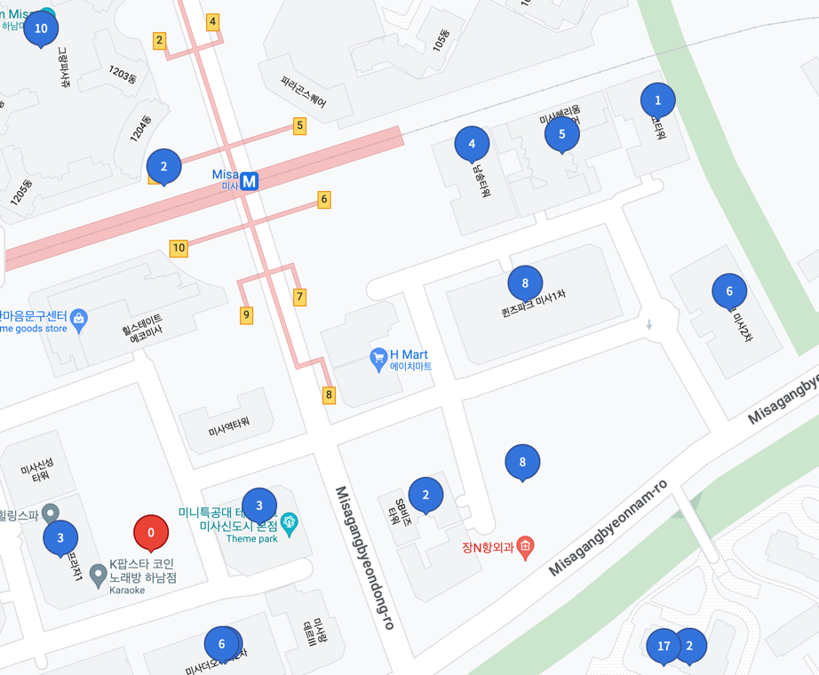</td>
    <td>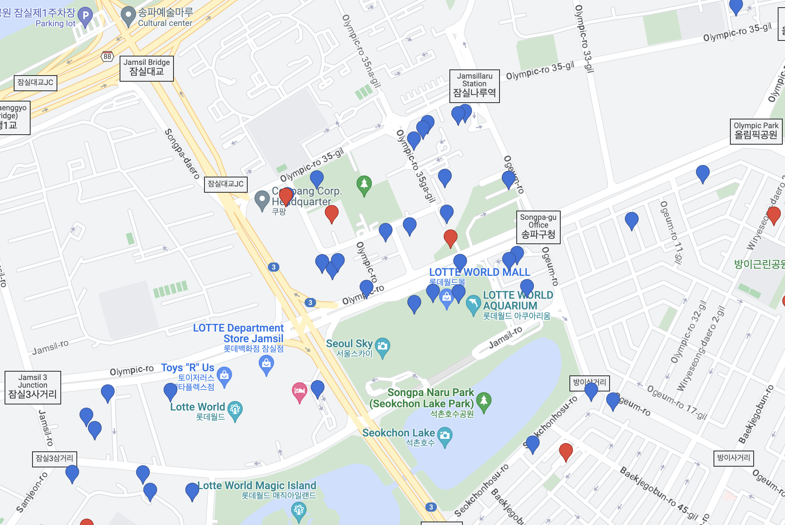</td>
  </tr>
</table>

<table>
  <tr>
    <td>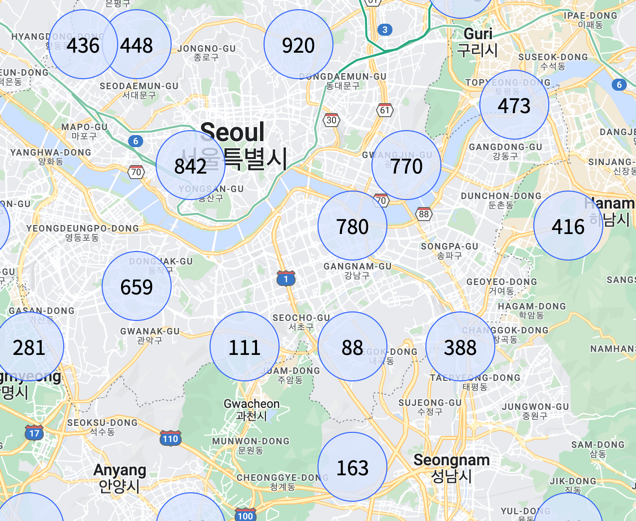</td>
    <td>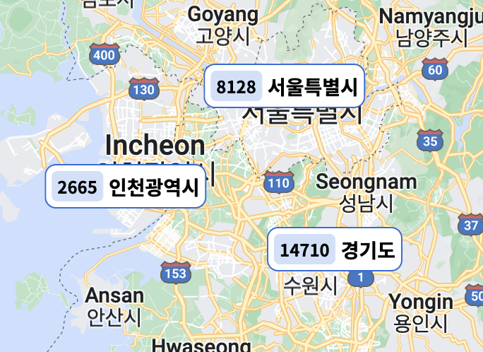</td>
  </tr>
</table>

### 전국 충전소 검색 및 필터링

<table>
  <tr>
    <td></td>
    <td></td>
  </tr>
</table>

### 충전소 정보 조회

<table>
  <tr>
    <td>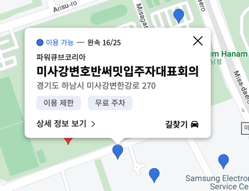</td>
    <td>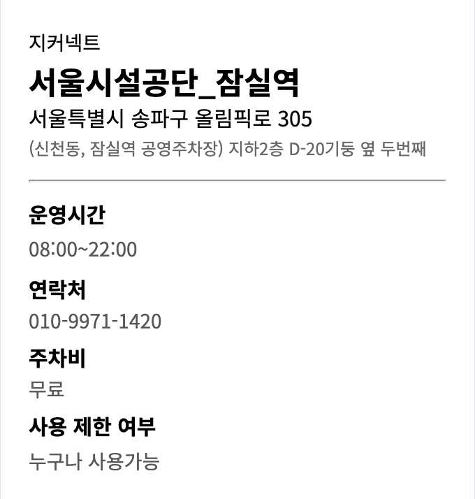</td>
  </tr>
</table>

<table>
  <tr>
    <td>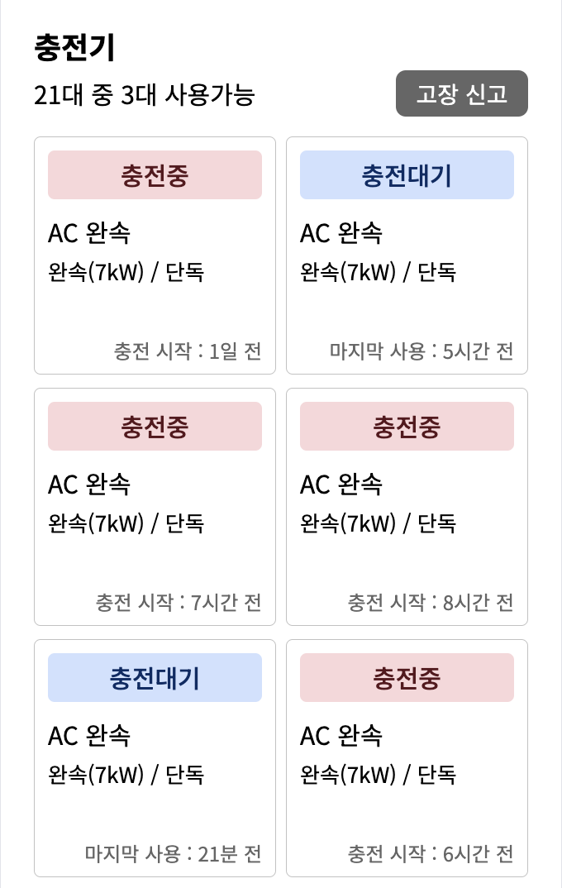</td>
    <td>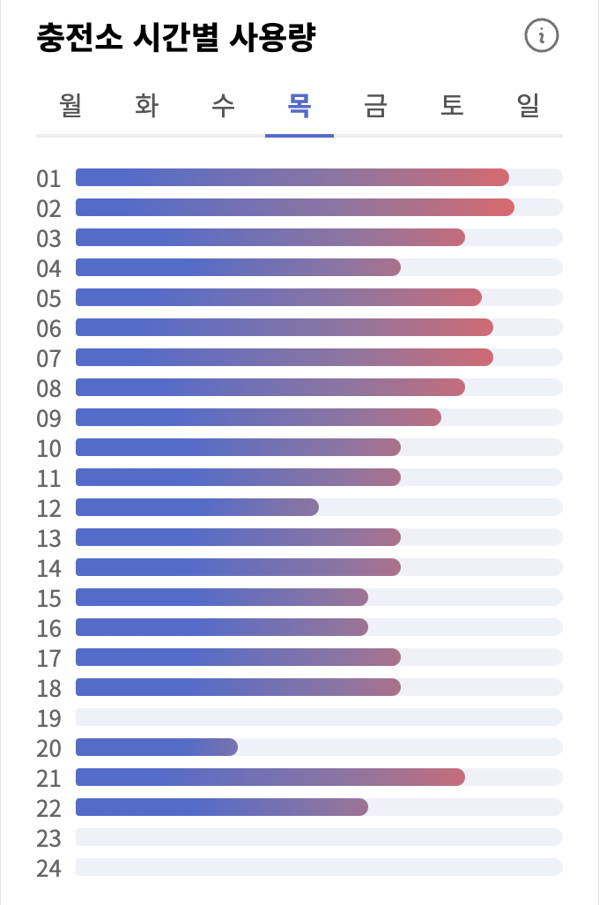</td>
  </tr>
</table>

<table>
  <tr>
    <td>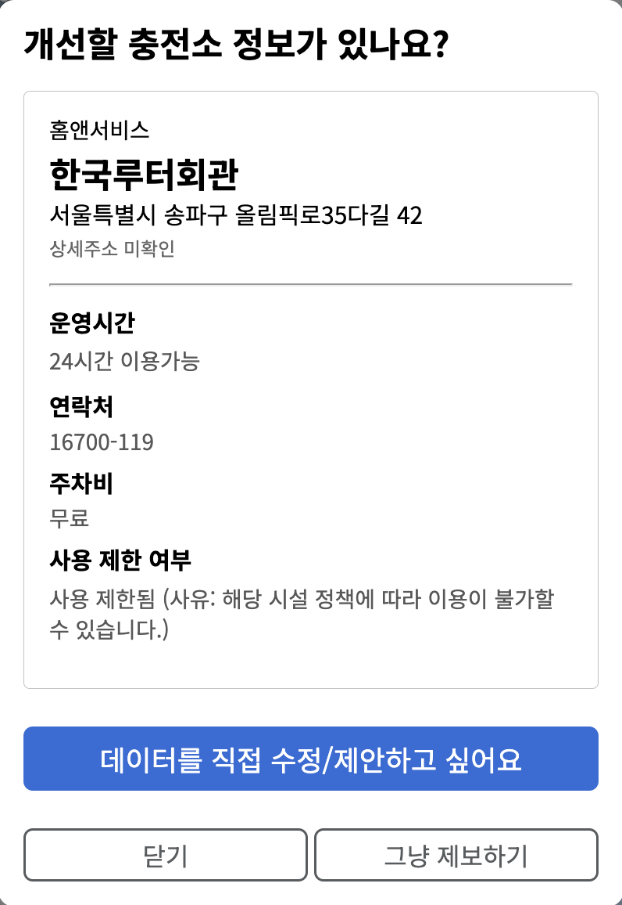</td>
    <td>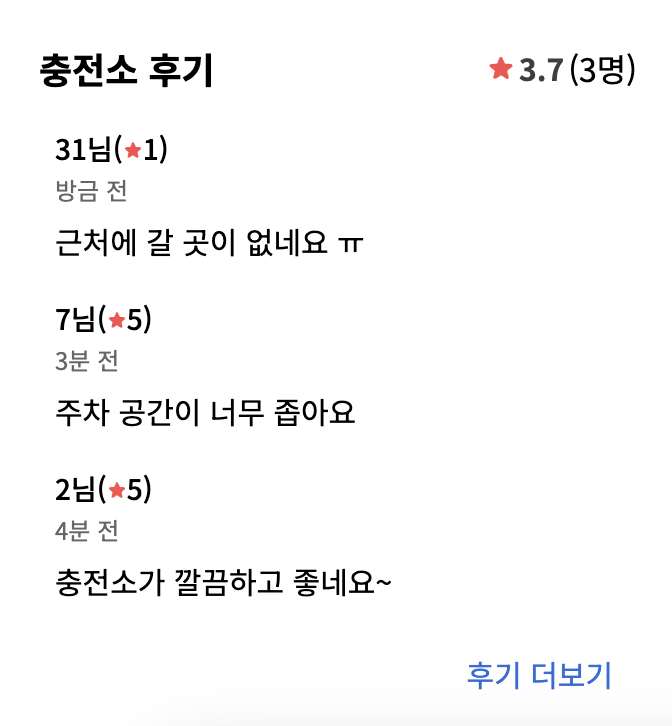</td>
  </tr>
</table>

### 지원 플랫폼

<table>
  <tr>
    <td align="center">
        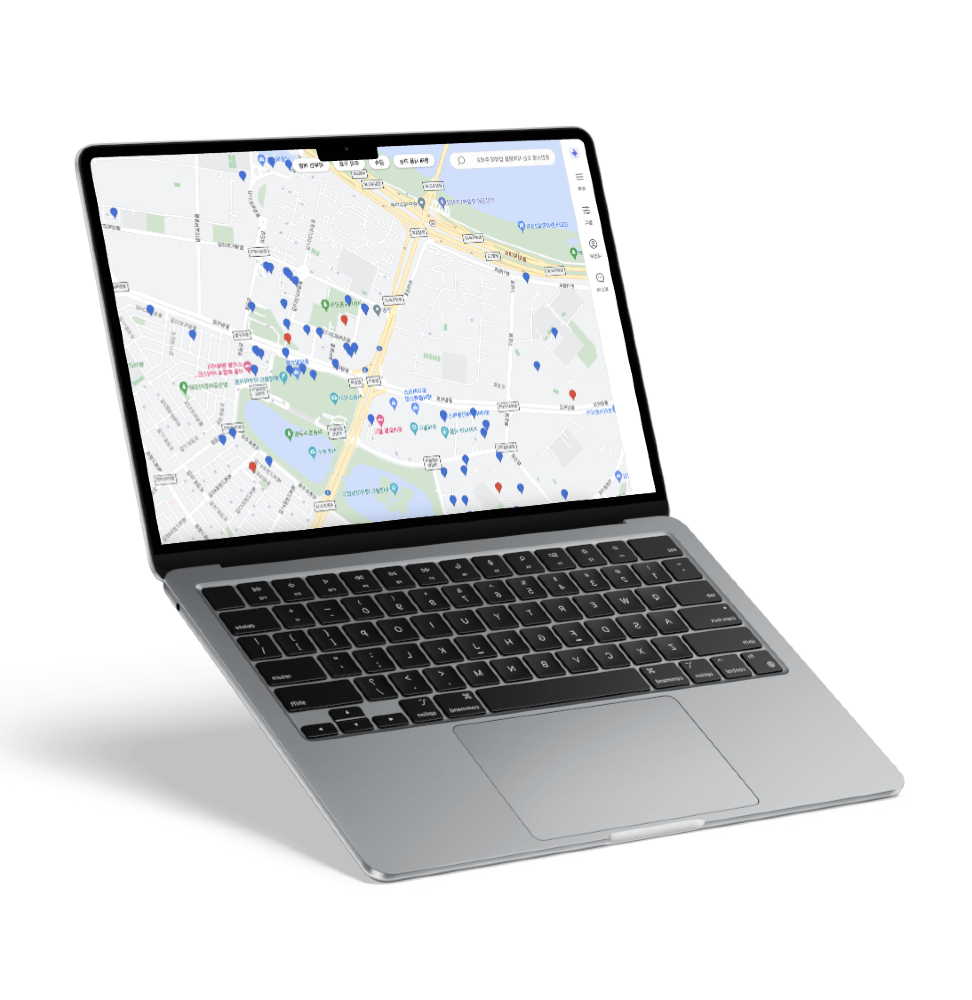
    </td>
    <td align="center">
        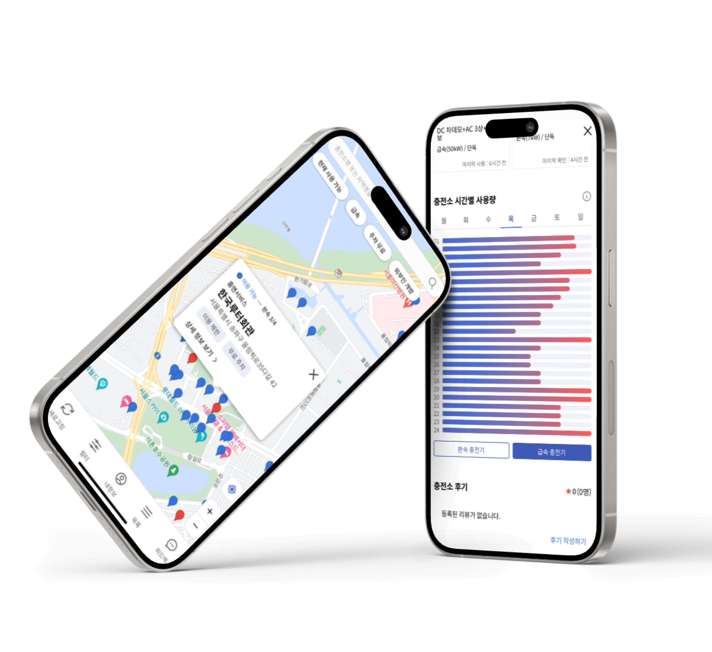
    </td>
  </tr>
  <tr>
    <td align="center">
        PC
    </td>
    <td align="center">
        Mobile
    </td>
  </tr>
</table>

## 프로젝트 구조

- CI/CD
    - GitHub Actions
    - Docker
    - (작성 예정)
- 기술
    - Frontend
        - React + Typescript
        - Tanstack Query
        - Google Maps API
        - webpack
        - styled-components
        - Storybook
        - Jest
        - React Testing Library
        - Eslint / Prettier
        - GitHub Actions
        - AWS S3 (예정)
        - AWS CloudFront (예정)
    - Backend
        - (작성 예정)

## 팀원 소개

### Frontend

<table>
  <tr>
    <td align="center" width="200px">
      
    </td>
    <td align="center" width="200px">
      
    </td>
    <td align="center" width="200px">
      
    </td>
  </tr>
  <tr>
    <td align="center">
      <a href="https://github.com/gabrielyoon7" target="_blank">
        가브리엘(윤주현)
      </a>
    </td>
    <td align="center">
      <a href="https://github.com/kyw0716" target="_blank">
        센트(김영우)
      </a>
    </td>
    <td align="center">
      <a href="https://github.com/feb-dain" target="_blank">
        야미(이다인)
      </a>
    </td>
  </tr>
</table>

### Backend

<table>
  <tr>
    <td align="center" width="200px">
      
    </td>
    <td align="center" width="200px">
      
    </td>
    <td align="center" width="200px">
      
    </td>
    <td align="center" width="200px">
      
    </td>
  </tr>
  <tr>
    <td align="center">
      <a href="https://github.com/be-student" target="_blank">
        누누(송은우)
      </a>
    </td>
    <td align="center">
      <a href="https://github.com/drunkenhw" target="_blank">
        박스터(한우석)
      </a>
    </td>
    <td align="center">
      <a href="https://github.com/sosow0212" target="_blank">
        제이(이재윤)
      </a>
    </td>
    <td align="center">
      <a href="https://github.com/kiarakim" target="_blank">
        키아라(김도희)
      </a>
    </td>
  </tr>
</table>

## 사용자 유치

[확인하기](./docs/ga4/ga4.md)

## 더보기

- [카페인팀 블로그](https://car-ffeine.github.io/archive)
